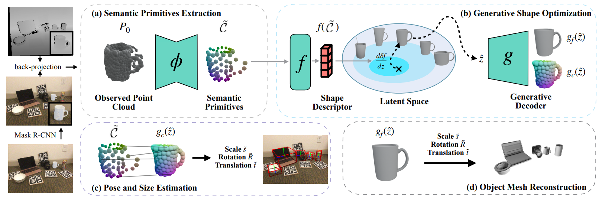

# Generative Category-Level Shape and Pose Estimation with Semantic Primitives

[](https://paperswithcode.com/sota/6d-pose-estimation-using-rgbd-on-real275?p=generative-category-level-shape-and-pose)
### [Project Page](https://zju3dv.github.io/gCasp) | [Paper](https://arxiv.org/abs/2210.01112) | [OpenReview](https://openreview.net/forum?id=N78I92JIqOJ) | [Poster](https://drive.google.com/file/d/1U1VwOpN_lN1rUAS_2MQkH1glVoG9wp3s/view?usp=sharing)

<div align=center>

</div>

> [Generative Category-Level Shape and Pose Estimation with Semantic Primitives](https://zju3dv.github.io/gCasp)<br/>
> Guanglin Li, Yifeng Li, Zhichao Ye, Qihang Zhang, Tao Kong, Zhaopeng Cui, Guofeng Zhang. <br/>
> CoRL 2022 

## Data prepration
### Step 1: Prepare DualSDF pretrained models
Follow the instruction of [this repo](https://github.com/liguanglin/DualSDF). Place the pretrained DualSDF checkpoints into the directory $ROOT/eval_datas/ like:
```
eval_datas/
    DualSDF_ckpts/
```
### Step 2: Prepare NOCS evaluation data
Download the [ground truth annotation of test data](http://download.cs.stanford.edu/orion/nocs/gts.zip), [Mask R-CNN results](https://drive.google.com/file/d/1p72NdY4Bie_sra9U8zoUNI4fTrQZdbnc/view), [object meshes](http://download.cs.stanford.edu/orion/nocs/obj_models.zip) and [real test data](http://download.cs.stanford.edu/orion/nocs/real_test.zip). Unzip them and organize these files in $ROOT/eval_datas/ as follows:
```
eval_datas/
    DualSDF_ckpts/
    gts/
    obj_models/
    deformnet_eval/
    real/
        test/
```

### step 3: Prepare NOCS training data
Prepare the primitive annotation by the follow script:
```bash
python generate_primitive.py
```
Download [CAMERA training data](http://download.cs.stanford.edu/orion/nocs/camera_train.zip), [ground truth annotation](https://drive.google.com/file/d/1DvQB__yspNcxV-Yiu-HKpRIQBGezaKjK/view?usp=sharing) and [Composed_depths](http://download.cs.stanford.edu/orion/nocs/camera_composed_depth.zip), and unzip them. After the above steps, the dictionary should be like:
```
train_datas/
    data_lists/
    NOCS_primitives/
    train/
    camera_full_depths/
        train/
```

## Training
The pretrained model can be download from [Google Drive](https://drive.google.com/file/d/1Voz-_p0X9cFmNey-yRbnkV6hsVYmDVzZ/view?usp=sharing), or you can train the model by:
```bash
python train.py ./config/gcn3d_seg/gcn3d_seg_all_256.yaml 
```
The training process would take about 1.5 hours for each epoch.


## Evaluation
The results present in the paper can be downloaded from [Google Drive](https://drive.google.com/file/d/1cznjCC8o3uHAfNPPnTSNZ9ONBFk1leDg/view?usp=sharing), or you can produce the result by:
```bash
python eval.py ./config/gcn3d_seg/gcn3d_seg_all_256.yaml --pretrained <path_to_segmentation_ckpt> # --draw (save result images)
```
The evaluation process would take about 30 minutes. After the results is saved, you can check the metrics by:
```bash
python SGPA_tools/evaluate.py --result_dir <path_to_result>
```
The curve image and metric results could be found in the result dictionary.

## Citation
If you find our work is useful, please consider cite:
```
@inproceedings{
li2022generative,
title={Generative Category-Level Shape and Pose Estimation with Semantic Primitives},
author={Li, Guanglin and Li, Yifeng and Ye, Zhichao and Zhang, Qihang and Kong, Tao and Cui, Zhaopeng and Zhang, Guofeng},
booktitle={6th Annual Conference on Robot Learning},
year={2022},
url={https://openreview.net/forum?id=N78I92JIqOJ}
}
```
## Acknowledgement

In this project we use (parts of) the implementations of the following works:

- [DualSDF](https://github.com/zekunhao1995/DualSDF) by zekunhao1995.
- [NOCS_CVPR2019](https://github.com/hughw19/NOCS_CVPR2019) by hughw19.
- [SGPA](https://github.com/ck-kai/SGPA) by ck-kai.
- [3dgcn](https://github.com/zhihao-lin/3dgcn) by zhihao-lin.


We thank the respective authors for open sourcing their methods. 
